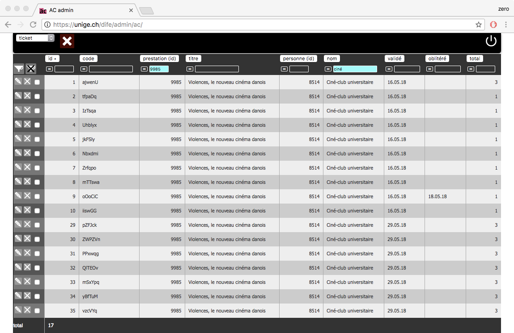
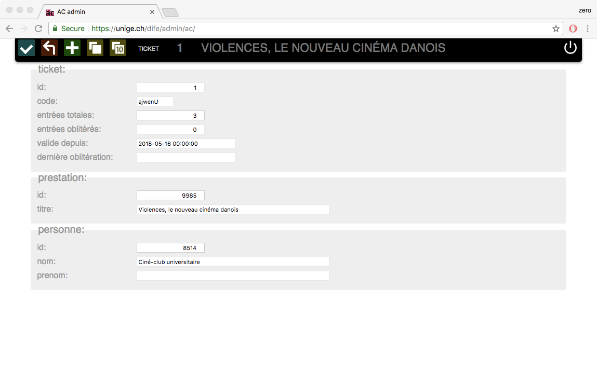
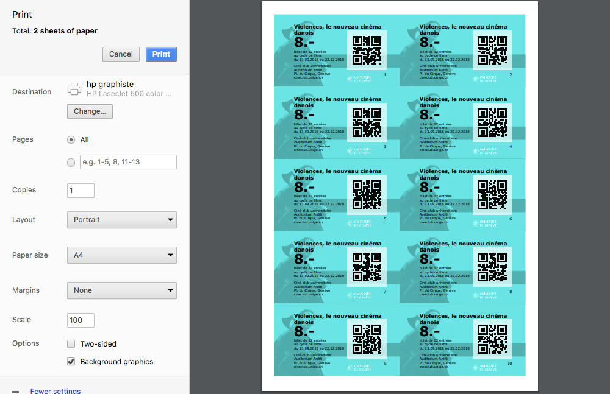
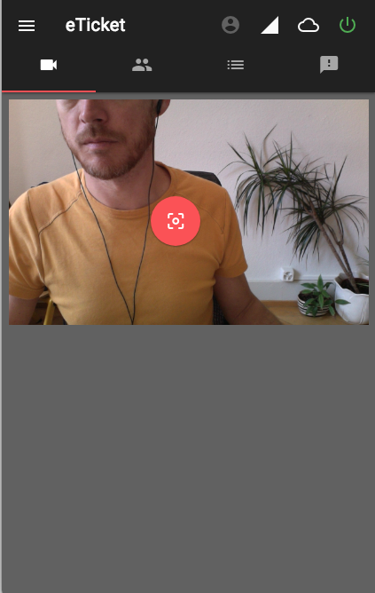
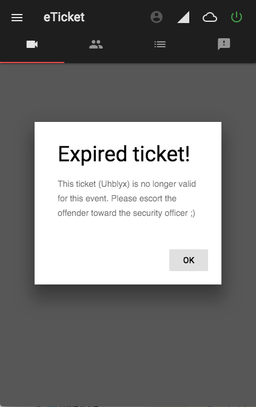
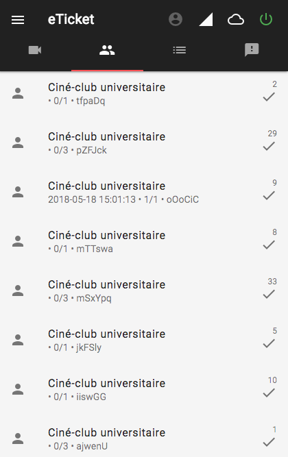

# Scanner de etickets

Le Ciné-club universitaire de Genève (CCU) est une manifestation culturelle organisée par des étudiants et d'anciens étudiants depuis plus de 60 ans. Les Activités culturelles de l'Université de Genève soutiennent le CCU au niveau financier, logistique et qualitativement. Chaque année académique le CCU organise 3 cycles de 12 films projetés au l'Auditorium Arditi (Place du Cirque 1, Genève).
Jusqu'à aujourd'hui un caissier encaisse de l'argent liquide (en francs suisses) et remet en échange 3 types de billet papier: 1 entrée à 8.-, 3 entrées à 18.- ou un abonnement à 50.- pour l'ensemble du cycle.
Un audit interne de l'UNIGE a pointé différents problèmes concernant les transactions financières autour de l'achat des billets de cinéma. Par exemple:
- transaction uniquement au comptant (argent liquide)
- pas de double regard sur les entrées / sorties d'argent des mains du caissier
- pas de reçus (ticket de caisse) pour les spectateurs
- pas de contre-marque après être rentré dans la salle (souche)
- certaines personnes rentrent et sortent sans être comptées / décomptées

Pour remédier à ces problèmes, plusieurs modifications ont été entreprises:
- acquisition d'un terminal de paiement éléctronique à la caisse
- devellopement d'un webshop online

C'est sur ce dernier point que mon travail se concentre. En effet cela implique que le site web dispose d'un panier d'achat, d'un module de paiement et de distribution des billets de cinéma.
Une fois que les spectateurs seront munis de leur billets, imprimés sur papier ou affichés sur l'écran de leur smartphones, il s'agit pour l'ouvreuse de pouvoir "oblitérer" le billet.
J'ai donc décidé que tous les billets émis: en ligne ou vendu directement sur place seraient munis d'un code bar afin d'être scannés par l'ouvreuse et donc univoquement identifiés et oblitérés.
Vu l'état du métier, vu l'état des outils existant et après discussion avec le manager de CCU, j'ai décidé de procéder par étapes. Au final 4 chantiers seront réalisés:
- une interface d'administation permetant à au manager de créer et gérer les billets
- un webshop permetant aux spectateurs de pouvoir acheter des billets
- un REST api exposant aux personnes authorisées (l'équipe CCU) la liste des billets en circulation
- une application web permettant à l'ouvreuse des scanner les billets à l'entrée du cinéma grâce à un smartphone tournant sous Android.

L'essentiel du développement que je soumet à évaulation porte sur ce dernier point. Ceci dit j'ai quand même dû réaliser tout ou partie de l'interface d'admin et de l'api pour que le "scanner" soit utilisable.

### admin
Une interface d'administrations des événements, notamment, des séances de cinéma pour le Ciné-club universiatire existe depuis des années.
Je l'ai complétée avec une vue de gestion des etickets, afin de les créer, de les supprimer, de les compter ou de les identifier.

l'admin existe depuis des années, cependant je l'ai complétée afin qu'elle permette à l'administrateur de créer des etickets ou des les supprimer (invendus). 

Une CSS créée pour l'occasion permet à l'administrateur d'imprimer sur une imprimante de bureau des planches de tickets sur des feuilles prédécoupées. Ces tickets seront vendu directement à l'entrée du cinéma.

#### techno
- php
- MySQL
- js
- qrjs2.js (pour générer les qrcode) (https://github.com/englishextra/qrjs2.git)
- css

### REsT api
#### techno
- MySQL
- php (framework Slim3) (https://www.slimframework.com/)
- jwt (non opérationel: CORS) (https://jwt.io/)

### scanner
L'application pour scanner les billets, dans les mains de l'ouvreuse, est une simple page HTML, accessible par une URL. Seule les personnes authorisées peuvent recevoir et envoyer des données avec l'api. Une fois identifiée l'ouvreuse reçoit sur son smartphone la liste des spectateurs (et leur code respectif) attendu pour l'événement choisi. Elle active la caméra du smartphone, une bibliothèque JS cherche dans le flux caméra à décoder un QRCode, s'il est reconnu il est comparé avec les données dans la DB locale, s'il le code est valide et légitime, un retour visuel et haptique indique à l'ouvreuse que le spectateur peut entrer dans la salle. À chaque cycle de l'application les données locales sont envoyées sur le serveur distant et les données de ce dernier sont récupérées.

L'application est démarrée, le scanner a été activé, avec la caméra frontale

L'application signale que le billet n'est plus valide - avec une pointe d'humour

L'ouvreuse peut consulter la liste des spectateurs déjà dans la salle et ceux qui pourraient encore venir

#### techno
- html + css (material design) (https://getmdl.io/components/index.html et https://github.com/google/material-design-lite)
- js (es5) 2 bibliothèques spécifiques:
    - instascan (https://github.com/schmich/instascan)
    - dexie (https://github.com/dfahlander/Dexie.js)

#### fonctionalités
- login utilisateur
- scan qrcode via back ou front camera
- interprétation d'un qrcode dans une image
- offline DB: IndexedDB
- retour haptique pour l'utilisatrice: vibreur

L'équipe sur place (ouvreuse, caissier, manager, garde de sécurité) doit pouvoir disposer du moyen de controle des billets rapidement et facilement. Nous nous sommes dirigé vers une solution s'appuyant sur des smartphones dans la mesure où presque tout le monde en dispose d'un de nos jours. Cela évite également d'acheter, et d'entretenir un dispositif dédié: une douchette, p.ex. Cela permet de placer le "portique" d'entrée dans un lieu sans électricité ou sans meuble pour accueillir la douchette. Bref cette solution a l'avantage d'être économique et souple.
L'application doit pouvoir identifier l'ouvreuse ou la personne qui pourrait la remplacer (sécurité, manager …), idéalement l'application doit pouvoir fonctionner hors line (off line). En effet selon la configuration du lieu, le fond de la salle de cinéma, la connectivité UMTS/LTE est intermitante ou inexistante. L'application doit pouvoir valider/invalider un billet instantement même sans réseau de données. De plus, dans le contexte de séance de cinéma, une interface aux couleurs sombres est préférée par l'équipe.
Ceci dit nous rencontrons un problème logique dû au métier: nous aimerions que les spectateurs puissent acheter un billet sur leur smartphone quelques secondes avant d'entrer dans la salle, ce qui sera le cas en septembre 2018. Ce billet nouvellement émis par le système doit également exister dans la DB locale de l'application de l'ouvreuse, sinon elle n'authoriserait pas l'entrée au spectateur. Il faut donc trouver un compromis entre la synchronisation immédiate et différée des données.
C'est pourquoi l'application tourne sur un cycle de 5 secondes, ce qui me parraît une résolution temporelle suffisante pour disposer de la liste des derniers billets achetés avant que les spectateurs ne se présentent devant l'ouvreuse, mais aussi ayant un temps "mort" suffisement long pour ne pas faire des va-et-viens inutiles qui sollicitent le serveur et surtout le ou les smartphones sur le terrain.
Nous n'avons pas retenu de mécanisme fonctionnel qui irait cherhcher une fois pour toute un lot de billets potentiels (achetés ou non) et qui permeterait à l'ouvreuse de valider tous les billets possibles même sans aucune connectivité. En effet ce scénario empêcherait le travail en parrallèle. Un billet oblitéré auprès d'une ouvreuse serait encore valide auprès d'une autre. Selon les situations, selon le taux de fréquentation, il est tout à fait possible qu'il y ait plusieurs personnes au contrôle des billets. 

### ticket shop
à faire pour septembre