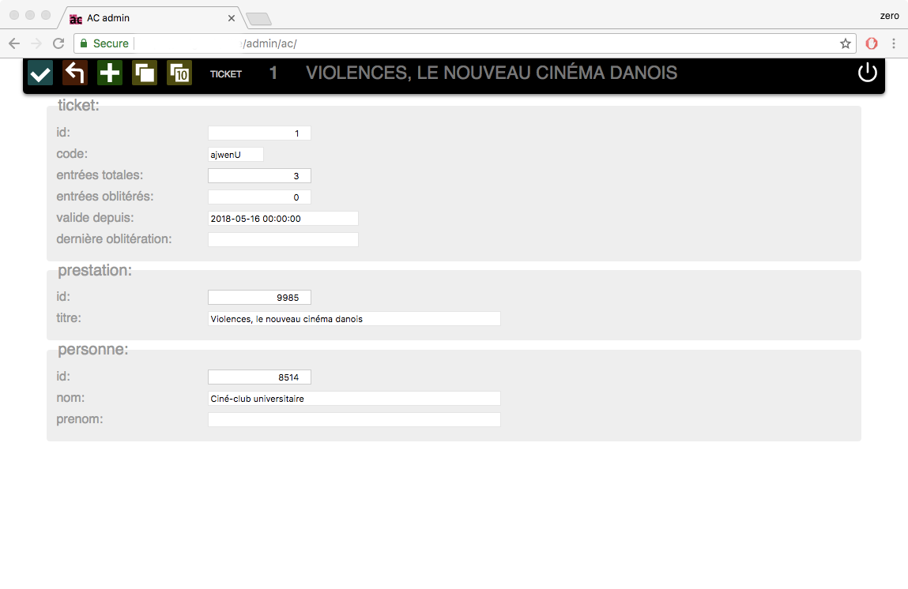

# Scanner de etickets développé selon le principe de PWA

Demo:
[CCU eTicket demo](https://julienjespersen.github.io/ccu_eticket/)

#### Remarques préliminaires
L'architecture générale de l'application (décrite plus loin) utilise les caratéristique d'un Progressive Web Apps (PWA) https://en.wikipedia.org/wiki/Progressive_Web_Apps . Cependant, il est assez compliquer d'activer, d'être parfaitement conforme à ces principes, étant encore en phasse de développement. Aussi pour tester sur un smartphone, veuillez noter que:
- fonctionne uniquement sur Android
- n'a été testée que sur Chrome (ou navigateurs utilsants webkit)
- lors des essais, préférez la navigation privée (le cache est mieux purgé à chaque essai)
- les avantages d'un PWA fonctionnent pas ou mal car l'application est servie depuis le dépot Github. P. ex. la fonction "add to home screen"

#### Introduction
Le Ciné-club universitaire de Genève (CCU) est une manifestation culturelle organisée par des étudiants et d'anciens étudiants depuis plus de 60 ans. Les Activités culturelles de l'Université de Genève soutiennent le CCU au niveau financier, logistique et qualitatif. Chaque année académique, le CCU organise 3 cycles de 10-12 films projetés à l'Auditorium Arditi (Place du Cirque, Genève).
Jusqu'à aujourd'hui, un caissier encaisse de l'argent liquide (en francs suisses) et remet en échange 3 types de billets papier: 1 entrée à 8.-, 3 entrées à 18.- ou un abonnement à 40 ou 50.- pour l'ensemble du cycle (pour 10 ou 12 séances).
Un audit interne de l'UNIGE a pointé différents problèmes concernant les transactions financières autour de l'achat des billets de cinéma. Par exemple:
- transaction uniquement au comptant (argent liquide)
- pas de double regard sur les entrées / sorties d'argent des mains du caissier
- pas de reçus (ticket de caisse) pour les spectateurs
- pas de contremarque après être entré dans la salle (souche)
- certaines personnes entrent et sortent sans être comptées / décomptées

Pour remédier à ces problèmes, plusieurs modifications ont été entreprises:
- acquisition d'un terminal de paiement électronique à la caisse
- développement d'un webshop

C'est sur ce dernier point que mon travail se concentre. En effet cela implique que le site web dispose d'un panier d'achat, d'un module de paiement et de distribution des billets de cinéma.
Une fois que les spectateurs sont munis de leur billets, imprimés sur papier ou affichés sur l'écran de leur smartphone, il s'agit pour l'ouvreuse de pouvoir oblitérer le billet.
J'ai donc décidé que tous les billets émis en ligne ou vendu directement sur place seraient: munis d'un code bar afin d'être scannés par l'ouvreuse et donc univoquement identifiés et oblitérés.
Vu l'état du métier, l'état des outils existants et après discussion avec le manager du CCU, j'ai décidé de procéder par étapes. Au final, 4 chantiers seront réalisés:
- une interface d'administation permettant au manager de créer et gérer les billets
- un webshop permettant aux spectateurs de pouvoir acheter des billets
- un REST api exposant aux personnes autorisées (l'équipe CCU) la liste des billets en circulation
- une application web permettant à l'ouvreuse des scanner les billets à l'entrée du cinéma grâce à un smartphone tournant sous Android.

L'essentiel du développement que je soumets à évaluation porte sur ce dernier point. Ceci dit, j'ai quand même dû réaliser l'entier ou une partie de l'interface d'admin et de l'api pour que le "scanner" soit utilisable.

## Console d'administration
Une interface d'administration des événements, notamment des séances de cinéma pour le Ciné-club universitaire, existe depuis des années.
Je l'ai complétée avec une vue de gestion des etickets, afin de les créer, de les supprimer, de les compter ou de les identifier.

L'admin existe depuis des années, cependant, je l'ai complétée afin qu'elle permette à l'administrateur de créer des etickets ou des les supprimer (invendus). 

Une CSS créée pour l'occasion permet à l'administrateur d'imprimer sur une imprimante de bureau des planches de tickets sur des feuilles prédécoupées. Ces tickets seront vendu directement à l'entrée du cinéma.

#### Technologies
- php
- MySQL
- js
- qrjs2.js (pour générer les QR codes) (https://github.com/englishextra/qrjs2.git)
- css

### Serveur REST api
Le serveur REST permet de connecter un utilisateur grâce à JWT (https://jwt.io/). Actuellement désactivé à cause d'un problème lié à CORS.
Il permet de donner la liste des tickets en circulation (validés) pour un événement précis.
2 types d'utilisateurs peuvent consulter et modifier les tickets: un utilisateur ayant un rôle de gestionnaire pour un événement donné (p.ex. l'ouvreuse) et un utilisateur ayant un statut de manager ou d'administrateur (p.ex. le manager du CCU)

#### Technologies
- MySQL
- php (framework Slim3) (https://www.slimframework.com/)
- jwt (non opérationel: CORS) (https://jwt.io/)

## Scanner (Application)
L'application pour scanner les billets, dans les mains de l'ouvreuse, est une simple page HTML, accessible par une URL. Seules les personnes autorisées peuvent recevoir et envoyer des données avec l'api. Une fois identifiée, l'ouvreuse reçoit sur son smartphone la liste des spectateurs (et leurs codes respectifs) attendue pour l'événement choisi. Elle active la caméra du smartphone, une bibliothèque JS cherche alors dans le flux caméra à décoder un QRCode; s'il est reconnu, il est comparé avec les données dans la DB locale; si le code est valide et légitime, un retour visuel et haptique indique à l'ouvreuse que le spectateur peut entrer dans la salle. À chaque cycle de l'application, les données locales sont envoyées sur le serveur distant et les données de ce dernier sont récupérées.

L'application est démarrée, le scanner a été activé avec la caméra frontale du smartphone.

L'application signale que le billet n'est plus valide - avec une pointe d'humour!

L'ouvreuse peut consulter la liste des spectateurs déjà dans la salle et ceux qui pourraient encore venir.

#### Technologies
- html + css (material design) (https://getmdl.io/components/index.html et https://github.com/google/material-design-lite)
- js (es5) 2 bibliothèques spécifiques:
    - instascan (https://github.com/schmich/instascan)
    - dexie (https://github.com/dfahlander/Dexie.js)

J'ai pris le parti de ne pas construire une application "native" pour la plateforme Android ou IOS. D'une part, ce n'est pas rationnel car il faut développer et maintenir 2 versions de la même application, ensuite c'est contraignant: il faut payer, s'identifier ou se conformer à des règles légales pour utiliser les magasins d'applications (App Store ou Google Play) pour distribuer son application.
Par ailleurs, le développement des HTML APIs connaît un grand essort ces derniers temps. Concrètement, une page web peut directement interagir avec le gyroscope, le vibreur, la caméra ou encore le mode on/offline de l'appareil sur lequel elle se trouve: p. ex. votre smartphone.
Un autre avantage: pas d'installation nécessaire.
La bibliothèque Material Design Light donne un look and feel très proche d'une application native. Les bibliothèques annexes me permettent d'accéder à la caméra et au stockage des données dans le navigateur. J'ai ainsi suffisamment de fonctionnalités pour construire une application minimale qui répond aux besoins du Ciné-club universitaire.

#### Outils
- outil de versionning avec dépôt: git (https://github.com/julienjespersen/ccu_eticket)
- éditeur de texte: Visual Studio Code. Avec syntax highlighting, autocompletion et built-in git commands

#### Fonctionnalités
- login utilisateur
- scan QRCode via back ou front camera
- interprétation d'un QRCode dans une image
- offline DB: IndexedDB
- retour haptique pour l'utilisatrice: vibreur

L'équipe sur place (ouvreuse, caissier, manager, agent de sécurité) doit pouvoir disposer du moyen de contrôle des billets rapide et facile d'usage. Nous nous sommes dirigés vers une solution s'appuyant sur des smartphones dans la mesure où presque tout le monde en dispose de nos jours. Cela évite également d'acheter et d'entretenir un dispositif dédié: une douchette, p.ex. Cela permet de placer le "portique" d'entrée dans un lieu sans électricité ou sans meuble devant accueillir une douchette. Bref, cette solution a l'avantage d'être économique et souple.
L'application doit pouvoir identifier l'ouvreuse ou la personne qui pourrait la remplacer (sécurité, manager, etc.); idéalement l'application doit pouvoir fonctionner hors ligne (off line). En effet, selon la configuration du lieu, si par exemple on se trouve au fond de la salle de cinéma, la connectivité UMTS/LTE est intermittente ou inexistante. L'application doit pouvoir valider/invalider un billet instantanément même sans réseau de données. De plus, dans le contexte d'une séance de cinéma, une interface aux couleurs sombres est préférée par l'équipe.
Ceci dit, nous rencontrons un problème logique dû au métier: nous aimerions que les spectateurs puissent acheter un billet sur leur smartphone quelques secondes avant d'entrer dans la salle, ce qui sera le cas dès septembre 2018. Ce billet nouvellement émis par le système doit également exister dans la DB locale de l'application de l'ouvreuse, sinon elle n'autorise pas l'entrée au spectateur. Il faut donc trouver un compromis entre la synchronisation immédiate et différée des données.
C'est pourquoi l'application tourne sur un cycle de 5 secondes, ce qui me paraît être une résolution temporelle suffisante pour disposer de la liste des derniers billets achetés avant que les spectateurs ne se présentent devant l'ouvreuse, et qui a aussi un "temps mort" suffisement long pour ne pas faire des va-et-vient inutiles qui sollicitent le serveur et surtout le ou les smartphones sur le terrain.
Nous n'avons pas retenu de mécanisme fonctionnel qui irait chercher une fois pour toute un lot de billets potentiels (achetés ou non) et qui permettrait à l'ouvreuse de valider tous les billets possibles même sans aucune connectivité. En effet ce scénario empêcherait le travail en parallèle. Un billet oblitéré auprès d'une ouvreuse serait encore valide auprès d'une autre. Selon les situations et selon le taux de fréquentation, il est tout à fait possible qu'il y ait plusieurs personnes au contrôle des billets. 

## Webshop
En ligne pour septembre 2018

## Remarques finales
- Pour les besoins de démonstration, aucun login n'est nécéssaire
- Une planche de tickets en PDF est fournie à titre d'exemple (readme_rsc/admin_table_tickets-mozaic.pdf)
- La voie de retour (mise à jour des données en POST) n'est pas implémentée afin de pour voir tester librement et pourvoir réinitialiser l'application dans son état d'origine
- le menu ne contient aucun lien fonctionnel, il est là à titre d'exemple. Des phases d'UX nous diront s'il devrait être utilisé ou non

## 
